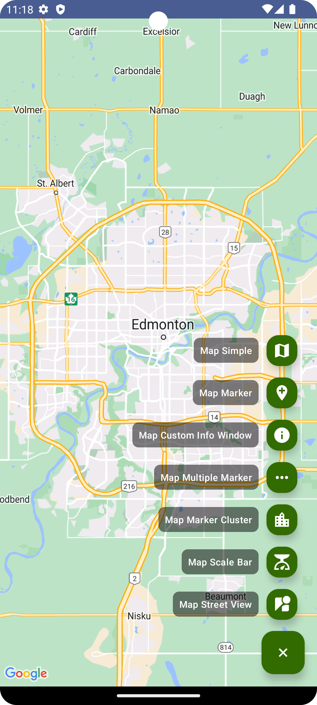
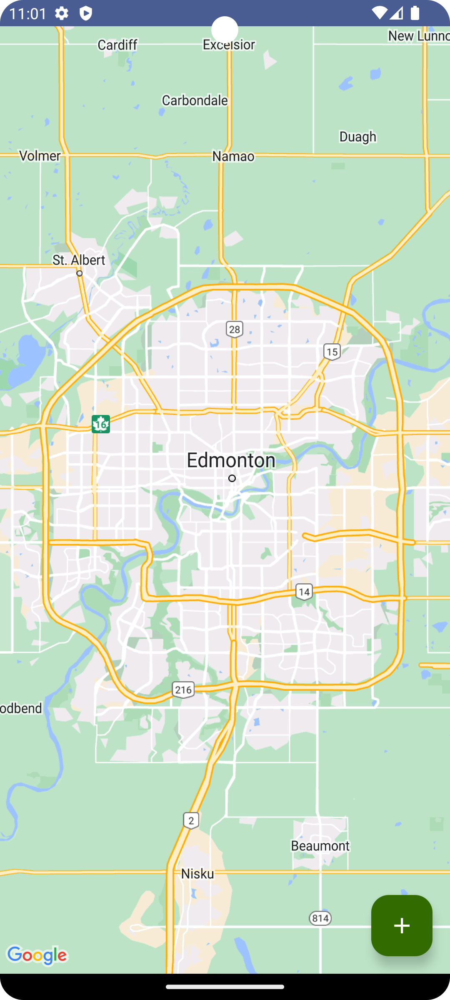
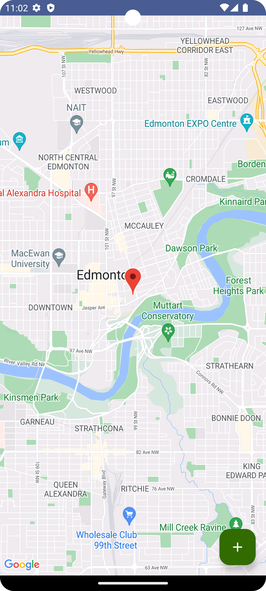
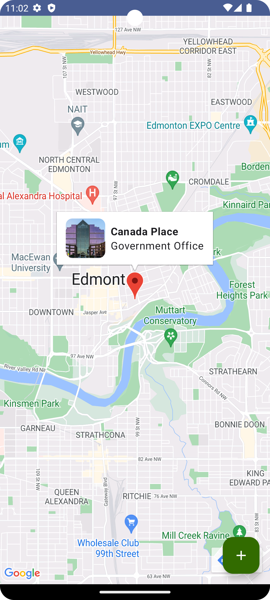
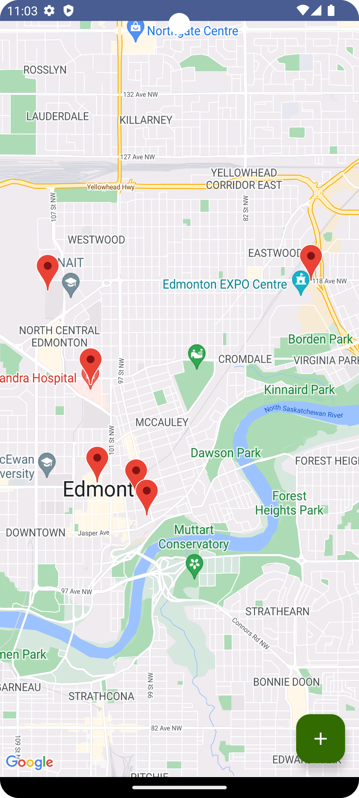
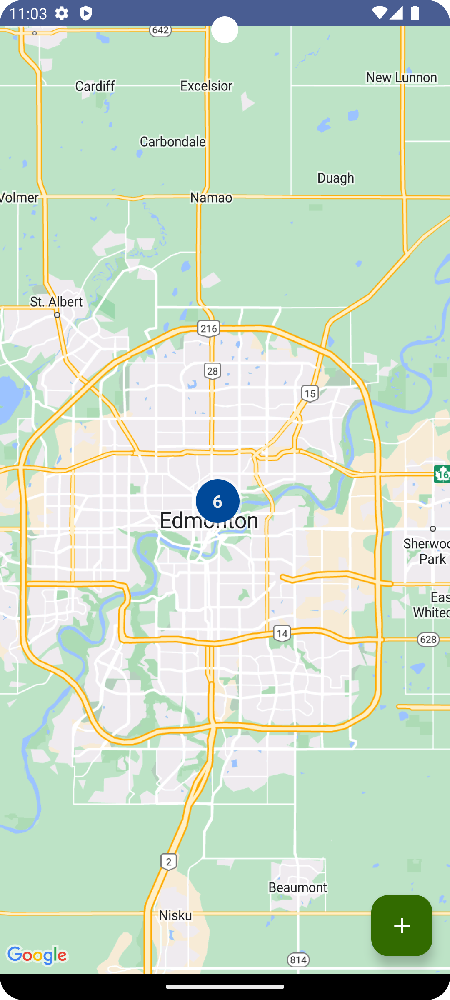
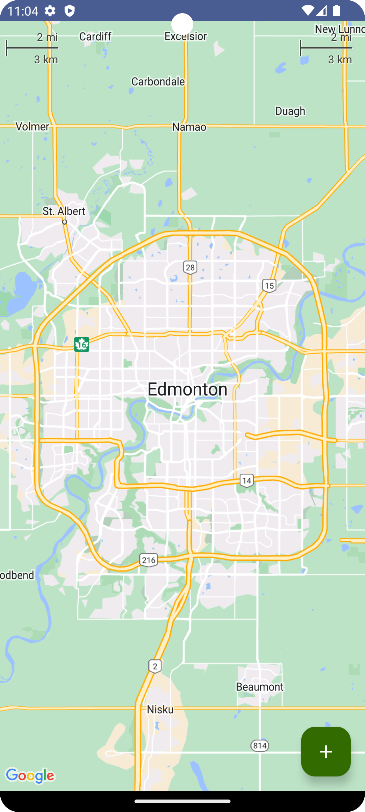

[](https://ktlint.github.io/)
[](https://developer.android.com/jetpack/compose)
[](https://kotlinlang.org/)
[](https://android-arsenal.com/api?level=21)
[](https://opensource.org/licenses/Apache-2.0)

<p align="center"> 
    
</p>

<h1 align="center"> Jetpack Compose Google Map </h1>

Explore the dynamic capabilities of [Jetpack Compose](https://www.googleadservices.com/pagead/aclk?sa=L&ai=DChcSEwirxJ-8nJGAAxWezMIEHZm2DusYABACGgJwdg&ohost=www.google.com&cid=CAESa-D2E9EHPMO24ZVeohcQzPgBKtfVfkbnufBlV2qUiGJ5XL1vhNoQ7Yyk9acePAcC0Xrx3KvcDy_b5pvHL3nlRFYBNebz9_mLYiGTkq45DFvSST2UrzbFYFcZWc4RNKcXC6Bs884F7_fCsX0t&sig=AOD64_1j28Y5zCwhCJe_uPcFZYyLdXxP9Q&q&adurl&ved=2ahUKEwjD8Zm8nJGAAxXPFzQIHcrGDR4Q0Qx6BAgKEAE&nis=8) in the realm of mapping with this open-source project. The "Jetpack Compose Google Map" provides a comprehensive demonstration of integrating Google Maps seamlessly into Jetpack Compose applications. 

This project serves as a valuable resource for developers diving into Jetpack Compose, offering practical examples of incorporating mapping features seamlessly. Whether you're building a location-based app or simply exploring the possibilities of Jetpack Compose, this showcase provides insights and code snippets to accelerate your development journey.

You can read the step-by-step guide in my [medium]() story.

## 🔐 Key Features
- __Google Maps Integration__: Effortlessly incorporate Google Maps into your Jetpack Compose project, providing a rich and interactive mapping experience.
- __Add Marker__: Learn how to add markers to the map, allowing you to personalize location indicators according to your app's design and theme.
- __Custom Info Window__: Enhance user engagement by creating customized info windows for your markers, delivering additional information in a visually appealing manner.
- __Multiple Markers__: Showcase the ability to add multiple markers on the map, perfect for applications that need to highlight various points of interest.
- __Clustering__: Implement marker clustering to improve map readability, especially in scenarios with a large number of markers.
- __Scale Bar__: Integrate a scale bar to provide users with a visual reference for distances on the map, improving overall navigation.
- __Street View__: Explore the incorporation of street view functionality, allowing users to virtually navigate through streets and explore locations at ground level.


## 🌳 Environment
Android Studio verison used : ``Android Studio Hedgehog | 2023.1.1 Canary 11``


## 🖼️ Demo Screens

|Overview|Map Simple View|Map Marker|
|-|-|-|
| | ||

|Map Custom Info Window|Map Multiple Marker|Map Marker Cluster|
|-|-|-|
| || |

|Map Scale Bar|
|-|
| |


## 💰 Bonus Knowledge

In this project, we have utilized [TOML (Tom's Obvious, Minimal Language)](https://developer.android.com/build/migrate-to-catalogs) as a configuration file format for managing `Gradle dependencies and plugins`. TOML provides a clean and easy-to-read syntax, making it simpler to manage and maintain the project's dependencies.

By using a TOML file, we can define and organize our Gradle dependencies and plugins in a structured manner. This approach enhances the `readability and maintainability` of our build configuration.

The TOML file in this project serves as a `centralized location` to specify the required dependencies and plugins, ensuring consistency across different build scripts. By utilizing TOML, we have streamlined the process of managing dependencies and plugins, making the project more efficient and easier to maintain.

Here is a basic example of what you can achieve with TOML:

## From

```
// Top-level `build.gradle.kts` file
plugins {
   id("com.android.application") version "7.4.1" apply false

}

// Module-level `build.gradle.kts` file
plugins {
   id("com.android.application")

}
dependencies {
    implementation("androidx.core:core-ktx:1.9.0")

}
```

## To
```
// Top-level build.gradle.kts
plugins {
   alias(libs.plugins.android.application) apply false

}

// module build.gradle.kts
plugins {
   alias(libs.plugins.android.application)

}
dependencies {
   implementation(libs.androidx.ktx)

}
```

## By adding code like this in libs.versions.toml
```
[versions]
ktx = "1.9.0"
androidGradlePlugin = "7.4.1"

[libraries]
androidx-ktx = { group = "androidx.core", name = "core-ktx", version.ref = "ktx" }

[plugins]
android-application = { id = "com.android.application", version.ref = "androidGradlePlugin" }

```

Feel free to explore the `TOML configuration file` in this project and adapt the approach to fit your own build management needs. You can find this file in project `gradle` folder with this name `libs.versions.toml`.


## 🤝 Contributing

Contributions are what make the open-source community such a fantastic place to learn, inspire,
and create. Any contributions you make are **greatly appreciated**.

If you would like to contribute, please follow these steps:

1. Open an issue first to discuss what you would like to change.
2. Fork the Project
3. Create your feature branch (`git checkout -b feature/amazing-feature`)
4. Commit your changes (`git commit -m 'Add some amazing feature'`)
5. Push to the branch (`git push origin feature/amazing-feature`)
6. Open a pull request

Please make sure to update tests as appropriate.

## ✍️ Author


👤 **DawinderGill**

[](https://www.linkedin.com/in/dawinder-singh-gill-2b1833171)
[](https://play.google.com/store/apps/dev?id=6322881499451604311)
[](https://medium.com/@dawinderapps)

Feel free to ping me 😉


## 📝 License

```
Copyright © 2023 - DawinderGill
